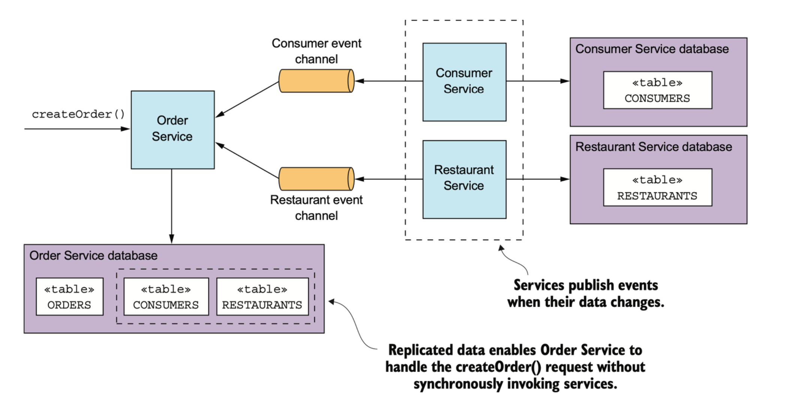

# 03-04-Asynchronous Messaging

## SLIDE 03-04-01

<figure><figcaption></figcaption></figure>

Come hai visto, ogni meccanismo di IPC presenta un trade-off diversi. Vediamo il problema della comunicazione sincrona e come influisce sulla disponibilità dei servizi.

REST è un meccanismo di IPC estremamente popolare come già visto e in effetti si potrebbe usare per la comunicazione tra i vari servizi. Il problema con REST è che è un protocollo **sincrono**: un client HTTP deve attendere che il servizio invii una risposta. Ogni volta che i servizi comunicano utilizzando un protocollo sincrono, la disponibilità dell'applicazione si riduce.

Vediamo lo scenario in figura.&#x20;

L'Order Service ha un'API REST per la creazione di un ordine e chiama il Consumer Service e il Restaurant Service per convalidare l'Ordine. Entrambi questi servizi hanno anche API REST.

La sequenza di passaggi per la creazione di un ordine è la seguente:

1. Il cliente invia una richiesta HTTP POST /orders all'Order Service.
2. L'Order Service recupera le informazioni sul consumatore effettuando una richiesta HTTP GET /consumers/id al Consumer Service.
3. L'Order Service recupera le informazioni sul ristorante effettuando una richiesta HTTP GET /restaurant/id al Restaurant Service.
4. L'Order Taking convalida la richiesta utilizzando le informazioni sul consumatore e il ristorante.
5. L'Order Taking crea un Ordine.
6. L'Order Taking invia una risposta HTTP al cliente.

Poiché questi servizi utilizzano HTTP, devono essere tutti disponibili contemporaneamente affinché l'applicazione UrbanEats possa elaborare la richiesta di CreateOrder. L'applicazione non potrebbe creare ordini se uno qualsiasi di questi tre servizi è inattivo. Matematicamente parlando, la disponibilità di un'operazione di sistema è il prodotto della disponibilità dei servizi che vengono invocati da tale operazione.&#x20;

Quindi se l'Order Service e i due servizi che esso chiama sono disponibili al 99,5%, la disponibilità complessiva è 99,5%3 = 98,5%, che anche se non sembra è significativamente inferiore. Ogni servizio aggiuntivo che partecipa alla gestione di una richiesta riduce ulteriormente la disponibilità.

Questo problema non è specifico della comunicazione basata su REST ma è tipica della architettura sincrona. Ad esempio, la disponibilità dell'Order Service sarebbe ridotta se inviasse un messaggio al Consumer Service tramite un message broker e poi aspettasse una risposta.

Se vuoi massimizzare la disponibilità, devi minimizzare la quantità di comunicazione sincrona e ci sono diverse modalità diverse per ridurre la quantità di comunicazione sincrona con altri servizi durante la gestione di richieste sincrone.&#x20;

Una soluzione è evitare completamente il problema definendo servizi che hanno solo API asincrone. Le API pubbliche sono comunemente RESTful e di conseguenza, talvolta è necessario che i servizi abbiano API sincrone.

Fortunatamente, esistono modi per gestire le richieste sincrone senza effettuare richieste sincrone. Vediamo delle opzioni disponibili.

## SLIDE 03-04-02

<figure><figcaption></figcaption></figure>

Idealmente, tutte le interazioni dovrebbero essere effettuate utilizzando gli stili di interazione asincrona come visto fino a questo punto.&#x20;

Ad esempio, supponiamo che un cliente dell'applicazione UrbanEats utilizzi uno stile di interazione asincrona per creare ordini. Un cliente crea un ordine inviando un messaggio di richiesta al servizio Order. Questo servizio quindi scambia messaggi in modo asincrono con altri servizi ed invia infine un messaggio di risposta al cliente. La figura mostra il design di questa architettura. Il client e i servizi comunicano in modo asincrono inviando messaggi tramite canali di messaggistica e quindi nessun partecipante in questa interazione è mai bloccato veramente in attesa di una risposta.

Una tale architettura sarebbe estremamente resiliente, poiché il message broker memorizza i messaggi fino a quando possono essere consumati. Il problema, tuttavia, è che spesso i servizi hanno un'API esterna che utilizza un protocollo sincrono come REST, quindi deve rispondere immediatamente alle richieste. Se un servizio ha un'API sincrona, un modo per migliorare la disponibilità è replicare i dati.&#x20;

## SLIDE 03-04-03

<figure><figcaption></figcaption></figure>

Un modo per ridurre al minimo le richieste sincrone durante l'elaborazione delle richieste è replicare i dati, cioè un servizio mantiene una replica aggiornata dei dati di cui ha bisogno durante l'elaborazione delle richieste e lo fa iscrivendosi agli eventi pubblicati dai servizi che possiedono i dati.&#x20;

Ad esempio, il servizio Order potrebbe mantenere una replica dei dati di proprietà del servizio Consumer e del servizio Restaurant. Questo consentirebbe al servizio Order di gestire una richiesta di creazione di un ordine senza dover interagire con quei servizi come vediamo nel design in figura.&#x20;

Il servizio Consumer e il servizio Restaurant pubblicano eventi ogni volta che i loro dati cambiano, il servizio Order si iscrive a questi eventi e aggiorna la sua replica. In alcune situazioni, la replica dei dati è un approccio utile.&#x20;

Come si può intuire uno svantaggio della replicazione è che talvolta può richiedere la replica di grandi quantità di dati, il che è inefficiente. Ad esempio, potrebbe non essere pratico per il servizio Order mantenere una replica dei dati di proprietà del servizio Consumer, a causa del gran numero di consumatori. Un altro svantaggio della replicazione è che non risolve il problema di come un servizio aggiorna i dati di proprietà di altri servizi. Un modo per risolvere questo problema è far sì che un servizio ritardi l'interazione con gli altri servizi fino a dopo aver risposto al proprio cliente come vedremo nella prossima slide.&#x20;

## SLIDE 03-04-04

<figure><figcaption></figcaption></figure>

Un altro modo per eliminare la comunicazione sincrona durante l'elaborazione delle richieste da parte di un servizio è gestire una richiesta nel seguente modo:

1. Convalidare la richiesta utilizzando solo i dati disponibili localmente.
2. Aggiornare il database, inclusa l'inserimento dei messaggi nella tabella OUTBOX.
3. Restituire una risposta al proprio client. Mentre gestisce una richiesta, il servizio non interagisce sincronamente con altri servizi. Invece, invia messaggi in modo asincrono ad altri servizi. Questo approccio garantisce che i servizi siano comunque debolmente accoppiati. Spesso questo approccio è implementato utilizzando un "saga". Ad esempio, se il servizio degli Ordini utilizza questo approccio, crea un ordine in uno stato PENDING e quindi convalida l'ordine in modo asincrono scambiando messaggi con altri servizi. La figura mostra cosa succede quando viene invocata l'operazione createOrder().&#x20;

La sequenza degli eventi è la seguente:

1. Il servizio Ordini crea un ordine in uno stato PENDING.
2. Il servizio Ordini restituisce una risposta al suo client contenente l'ID dell'ordine.
3. Il servizio Ordini invia un messaggio ValidateConsumerInfo al servizio Consumatori.
4. Il servizio Ordini invia un messaggio ValidateOrderDetails al servizio Ristoranti.
5. Il servizio Consumatori riceve un messaggio ValidateConsumerInfo, verifica che il consumatore possa effettuare un ordine e invia un messaggio ConsumerValidated al servizio Ordini.
6. Il servizio Ristoranti riceve un messaggio ValidateOrderDetails, verifica che il menu sia valido e che il ristorante possa consegnare all'indirizzo di consegna dell'ordine e invia un messaggio OrderDetailsValidated al servizio Ordini.
7. Il servizio Ordini riceve ConsumerValidated e OrderDetailsValidated e cambia lo stato dell'ordine in VALIDATED.

Il servizio Ordini può ricevere i messaggi ConsumerValidated e OrderDetailsValidated in qualsiasi ordine tendendo traccia di quale messaggio riceve per primo cambiando lo stato dell'ordine. Se riceve prima il messaggio ConsumerValidated, cambia lo stato dell'ordine in CONSUMER\_VALIDATED, mentre se riceve prima il messaggio OrderDetailsValidated, cambia lo stato in ORDER\_DETAILS\_VALIDATED. Il servizio Ordini cambia lo stato dell'ordine in VALIDATED quando riceve l'altro messaggio.Dopo che l'ordine è stato convalidato, il servizio Ordini completa il resto del processo di creazione dell'ordine.&#x20;

Ciò che è interessante in questo approccio è che anche se il servizio Consumer è inattivo, ad esempio, il servizio Ordini continua a creare ordini e a rispondere ai suoi clienti. Alla fine, il servizio Consumer tornerà in funzione e elaborerà eventuali messaggi in coda, e gli ordini verranno convalidati.&#x20;

Un inconveniente di un servizio che risponde prima di elaborare completamente una richiesta è che rende il client più complesso. Ad esempio, il servizio Ordini offre garanzie minime sullo stato di un ordine appena creato quando restituisce una risposta. Crea l'ordine e restituisce immediatamente una risposta prima di convalidare l'ordine e autorizzare la carta di credito del consumatore. Di conseguenza, affinché il client possa sapere se l'ordine è stato creato con successo, deve periodicamente effettuare sondaggi o il servizio Ordini deve inviargli un messaggio di notifica.&#x20;

Nonostante la sua complessità, in molte situazioni questo è l'approccio preferito, specialmente perché affronta anche le questioni relative alla gestione delle transazioni distribuite.&#x20;
