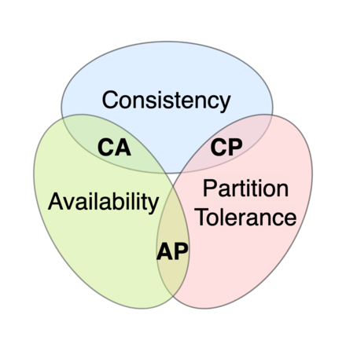

# 04-01 - Transaction management

## SLIDE 04-01-01

<figure><figcaption></figcaption></figure>

Torniamo al nostro studio di caso. Quando Lisa ha iniziato a investigare sull'architettura a microservizi, una delle sue maggiori preoccupazioni riguardava come implementare transazioni che coinvolgessero più servizi perché le transazioni sono un ingrediente essenziale di ogni applicazione aziendale. Senza transazioni sarebbe impossibile mantenere la coerenza dei dati.

Le transazioni ACID (Atomicità, Coerenza, Isolamento, Durabilità) ci semplificano notevolmente il lavoro come sviluppatori e ci forniscono l'illusione che ogni transazione abbia accesso esclusivo ai dati. In un'architettura a microservizi, le transazioni all'interno di un singolo servizio possono ancora utilizzare transazioni ACID ma la sfida sta nell'implementare transazioni per operazioni che aggiornano dati posseduti da più servizi.

Ad esempio l'operazione createOrder() che abbiamo visto in precedenza coinvolge numerosi servizi, tra cui _Order Service_, _Kitchen_ _Service_ e _Accounting Service_. Operazioni come queste richiedono un meccanismo di gestione delle transazioni che funzioni tra i servizi. Alla UrbanEats hanno scoperto che, come accennato, l'approccio tradizionale alla gestione delle transazioni distribuite non è una buona scelta per le applicazioni moderne. Invece delle transazioni ACID, un'operazione che coinvolge più servizi deve utilizzare ciò che è noto come saga, una sequenza di transazioni locali guidate da messaggi, per mantenere la coerenza dei dati. Una sfida delle saghe è che sono ACD (Atomicità, Coerenza, Durabilità). Mancano della caratteristica di **isolamento** delle tradizionali transazioni ACID. Di conseguenza, un'applicazione deve utilizzare ciò che sono noti come contromisure (o countermeasures), tecniche di progettazione che impediscono o riducono l'impatto delle anomalie di concorrenza causate dalla mancanza di isolamento.

In molti modi, l'ostacolo più grande che Lisa e gli altri dev dovranno affrontare nell'adozione dei microservizi è il passaggio da un singolo database con transazioni ACID a un'architettura multi-database con saghe ACD. Sono abituati alla semplicità del modello di transazione ACID. Ma in realtà, anche le applicazioni monolitiche come l'applicazione UrbanEats di solito non utilizzano transazioni ACID testuali. Ad esempio, molte applicazioni utilizzano un livello di isolamento delle transazioni inferiore per migliorare le prestazioni. Inoltre, molti processi aziendali importanti, come il trasferimento di denaro tra conti in banche diverse, sono coerenti a livello temporale.&#x20;

Analizziamo le sfide della gestione delle transazioni nell'architettura a microservizi e vediamo perché l'approccio tradizionale alla gestione delle transazioni distribuite non è un'opzione troppo valida e vediamo come mantenere la coerenza dei dati utilizzando le saghe.&#x20;

Dopo di che, esamineremo le due diverse modalità di coordinamento delle saghe: coreografia, in cui i partecipanti scambiano eventi senza un punto di controllo centralizzato, e con orchestrazione, in cui un controller centralizzato dice ai partecipanti della saga quale operazione eseguire.&#x20;

Cominciamo dando un'occhiata alla sfida della gestione delle transazioni in un'architettura a microservizi.

#### Gestione delle transazioni in un'architettura a microservizi&#x20;

La quasi totalità delle richieste gestite da un'applicazione enterprise viene eseguita all'interno di una transazione del database, utilizzando framework e librerie che semplificano la gestione delle transazioni.&#x20;

Alcuni framework e librerie forniscono un'API programmabile per gestire le transazioni mentre altri framework, come Spring, forniscono un meccanismo dichiarativo. Ad esempio Spring fornisce un'annotazione **@Transactional** che organizza l'esecuzione automatica delle invocazioni di metodi all'interno di una transazione. Di conseguenza, è semplice scrivere logica di business transazionale o, per essere più precisi, la gestione delle transazioni è semplice _in un'applicazione monolitica che accede a un singolo database_.&#x20;

La gestione delle transazioni è più complessa in un'applicazione monolitica complessa che utilizza database multipli e message broker. E in un'architettura a microservizi, le transazioni coinvolgono più servizi, ognuno dei quali ha il proprio database. In questa situazione, l'applicazione deve utilizzare un meccanismo più elaborato per gestire le transazioni.&#x20;

Come vedremo, l'approccio tradizionale dell'uso delle transazioni distribuite non è un'opzione valida per le applicazioni moderne. Invece, un'applicazione basata su microservizi **deve** utilizzare le saghe.&#x20;

#### La necessità di transazioni distribuite in un'architettura a microservizi&#x20;

Immagina di essere lo sviluppatore di UrbanEats responsabile dell'implementazione dell'operazione di sistema _createOrder()._ Ricordiamo che questa operazione deve verificare che il consumatore possa effettuare un ordine, verificarne i dettagli, autorizzare la carta di credito del consumatore e creare un ordine nel database. È relativamente semplice implementare questa operazione in una applicazione  monolitica.&#x20;

Tutti i dati necessari per convalidare l'ordine in questione sono facilmente accessibili ed inoltre possiamo utilizzare una transazione ACID per garantire la coerenza dei dati. Potresti utilizzare l'annotazione _@Transactional_ di Spring sul metodo di servizio createOrder(). Di contro, implementare la stessa operazione in un'architettura a microservizi è molto più complicato.&#x20;

Come vediamo in figura i dati necessari sono distribuiti tra diversi servizi. l'operazione createOrder() accede a dati in numerosi servizi. Legge dati da _Consumer Service_ e aggiorna dati in _Order Service_, _Kitchen Service_ e _Accounting Service_. Poiché ogni servizio ha il proprio database, è necessario utilizzare un meccanismo per mantenere la coerenza dei dati tra questi database.

Il problema delle transazioni distribuite L'approccio tradizionale per mantenere la coerenza dei dati tra servizi, database o message broker multipli è utilizzare le transazioni distribuite. Lo standard de facto per la gestione delle transazioni distribuite è il modello di elaborazione delle transazioni distribuite X/Open (X/Open XA - vedi [https://en.wikipedia.org/wiki/X/Open\_XA](https://en.wikipedia.org/wiki/X/Open\_XA)). XA utilizza il commit a due fasi (2PC) per garantire che tutti i partecipanti a una transazione effettuino il commit o il rollback. Uno stack tecnologico compatibile con XA è costituito da database e message broker compatibili con XA, driver di database e API di messaggistica e un meccanismo di comunicazione tra processi che propaga l'ID della transazione globale XA. La maggior parte dei database SQL è compatibile con XA, così come alcuni message broker. Le applicazioni Java EE possono, ad esempio, utilizzare JTA per eseguire transazioni distribuite.

Per quanto semplice possa sembrare, ci sono una serie di problemi con le transazioni distribuite. Un problema è che molte tecnologie moderne, compresi database NoSQL come MongoDB e Cassandra, non le supportano. Inoltre, le transazioni distribuite non sono supportate da message broker moderni come RabbitMQ e Apache Kafka. Di conseguenza, se insisti nell'utilizzo di transazioni distribuite, non puoi utilizzare molte tecnologie moderne.

**SLIDE 04-01-02**

<figure><figcaption></figcaption></figure>

**Un altro problema** delle transazioni distribuite è che rappresentano una forma di IPC sincrono, il che riduce la disponibilità perché affinché una transazione distribuita possa effettuare il commit, tutti i servizi partecipanti devono essere disponibili.&#x20;

Ricordiamo che la disponibilità è il prodotto della disponibilità di tutti i singoli partecipanti alla transazione quindi se una transazione distribuita coinvolge due servizi che sono disponibili al 99,5%, allora la disponibilità complessiva è del 99%, che è significativamente inferiore.&#x20;

Ogni servizio aggiuntivo coinvolto in una transazione distribuita riduce ulteriormente la disponibilità. Ricordiamo anche l'esistenza del teorema CAP, che afferma che un sistema può avere solo due delle tre seguenti proprietà: coerenza, disponibilità e tolleranza alle partizioni ([https://en.wikipedia.org/wiki/CAP\_theorem](https://en.wikipedia.org/wiki/CAP\_theorem)). Oggi gli architetti preferiscono avere un sistema che sia disponibile piuttosto che uno che sia coerente.

Quindi, le transazioni distribuite sono allettanti perché hanno grosso modo lo stesso modello di programmazione delle transazioni locali. Ma a causa dei problemi menzionati finora, le transazioni distribuite non sono una tecnologia valida per le applicazioni moderne a microservizi. Per risolvere il problema più complesso del mantenimento della coerenza dei dati in un'architettura a microservizi, un'applicazione deve utilizzare un meccanismo diverso che si basa sul concetto di servizi asincroni e debolmente accoppiati. Ecco dove entrano in gioco le saghe.

**SLIDE 04-01-03**

<figure><figcaption></figcaption></figure>

#### Utilizzare il pattern Saga per mantenere la coerenza dei dati

Le saghe sono meccanismi per mantenere la coerenza dei dati in un'architettura a microservizi senza dover utilizzare transazioni distribuite e si definisce una saga per ogni comando di sistema che deve aggiornare dati in più servizi. Di base una saga è una sequenza di **transazioni locali**. Ogni transazione locale aggiorna i dati all'interno di un singolo servizio utilizzando i noti framework e librerie di transazioni ACID menzionati in precedenza.

L'operazione di sistema avvia il primo passo della saga, il completamento di una transazione locale attiva l'esecuzione della successiva transazione locale. Un importante vantaggio della messaggistica asincrona è che assicura che tutte le fasi di una saga vengano eseguite, anche se uno o più partecipanti della saga sono temporaneamente non disponibili.&#x20;

Le saghe differiscono quindi dalle transazioni ACID in un paio di modi importanti. Per prima cosa mancano della proprietà di isolamento delle transazioni ACID ed inoltre poiché ogni transazione locale conferma le sue modifiche, una saga deve essere annullata utilizzando transazioni di compensazione.&#x20;

Vediamo un esempio di saga relativa alla Creazione dell'Ordine come illustrato in figura. Il servizio di _Ordine_ implementa l'operazione createOrder() utilizzando questa saga. La prima transazione locale della saga viene avviata dalla richiesta esterna di creare un ordine. Le altre cinque transazioni locali sono ciascuna innescate dal completamento della precedente a catena.

Vediamo quindi che questa saga è composta dalle seguenti transazioni locali:

1. _Servizio di Ordine:_ Crea un Ordine in uno stato APPROVAL\_PENDING.
2. _Servizio del Consumatore_: Verifica che il consumatore possa effettuare un ordine.
3. _Servizio di Cucina_: Convalida i dettagli dell'ordine e crea un Ticket in stato CREATE\_PENDING.
4. _Servizio di Contabilità:_ Autorizza la carta di credito del consumatore.
5. _Servizio di Cucina:_ Cambia lo stato del Ticket in AWAITING\_ACCEPTANCE.
6. _Servizio di Ordine_: Cambia lo stato dell'Ordine in APPROVED.

Successivamente vedremo come i servizi che partecipano a una saga comunicano utilizzando la messaggistica asincrona, un servizio pubblica un messaggio quando una transazione locale viene completata. Questo messaggio attiva quindi il passaggio successivo della saga.&#x20;

Non solo l'uso della messaggistica garantisce che i partecipanti della saga siano effettivamente debolmente accoppiati, ma garantisce anche che una saga venga completata. Questo perché se il destinatario di un messaggio non è temporaneamente disponibile, il message broker memorizza il messaggio fino a quando può essere consegnato.

A primo impatto le saghe sembrano semplici, ma ci sono alcune considerazioni da fare. Notiamo ad esempio la mancanza di isolamento tra le saghe oppure annullare le modifiche in caso di errore non è banale.&#x20;

**SLIDE 04-01-04**

<figure><figcaption></figcaption></figure>

Una caratteristica importante delle transazioni ACID tradizionali è che la logica di business può facilmente annullare una transazione se rileva la violazione di un qualche vincolo eseguendo una istruzione ROLLBACK e il database annulla tutte le modifiche apportate finora.&#x20;

Purtroppo, le saghe non possono essere automaticamente annullate, poiché ogni passaggio conferma le sue modifiche nel database locale. Ciò significa, ad esempio, che se l'autorizzazione della carta di credito fallisce nel quarto passo della Saga di Creazione dell'Ordine, l'applicazione UrbanEats deve esplicitamente annullare le modifiche apportate dai primi tre passi. È necessario scrivere ciò che sono note come **transazioni di compensazione**.

Supponiamo che l'ennesima transazione _(n + 1)_ di una saga fallisca. Gli effetti delle precedenti _n_ transazioni devono essere annullati. Concettualmente, ciascuno di quei passaggi, _Ti_, ha una transazione di compensazione corrispondente, _Ci_, che annulla gli effetti del _Ti_. Per annullare gli effetti di quei primi _n_ passaggi, la saga deve eseguire ciascun _Ci_ in ordine inverso.&#x20;

La sequenza di passaggi è _T1 ... Tn, Cn ... C1_, come mostrato in figura. In questo esempio, _Tn+1_ fallisce, il che richiede di annullare i passaggi _T1 ... Tn_.

La saga esegue le transazioni di _compensazione_ nell'ordine inverso delle transazioni in avanti: _Cn ... C1_. La meccanica di sequenziare le _Ci_ non è diversa dalla sequenza delle _Ti_. Il completamento di Ci deve innescare l'esecuzione di _Ci-1_.&#x20;

**SLIDE 04-01-05**

<figure><figcaption></figcaption></figure>

Consideriamo, ad esempio, la Saga di Creazione dell'Ordine. Questa saga può fallire per una varietà di motivi:

* Le informazioni sul consumatore non sono valide o il consumatore non è autorizzato a creare ordini.
* Le informazioni sul ristorante non sono valide o il ristorante non è in grado di accettare ordini.
* L'autorizzazione della carta di credito del consumatore fallisce.

Se una transazione locale fallisce, il meccanismo di coordinamento della saga deve eseguire transazioni di compensazione che respingono l'Ordine e possibilmente annullino il Ticket.&#x20;

In tabella vediamo  le transazioni di compensazione per ciascun passaggio della Saga di Creazione dell'Ordine ed è importante notare che non tutti i passaggi necessitano di transazioni di compensazione.&#x20;

I passaggi di sola lettura, come _verifyConsumerDetails()_, non hanno bisogno di transazioni di compensazione. Allo stesso modo, i passaggi come _authorizeCreditCard()_ che sono seguiti da passaggi che hanno sempre successo non necessitano di transazioni di compensazione.

Vedremo come i primi tre passaggi della Saga di Creazione dell'Ordine siano definiti transazioni **compensabili** perché sono seguiti da passaggi che possono fallire, come il quarto passaggio sia definito transazione di **inversione** della saga poiché è seguito da passaggi che non falliscono mai, e come gli ultimi due passaggi sono definiti transazioni **ripetibili** perché hanno sempre successo.

Per capire come vengono utilizzate le transazioni di compensazione, immaginiamo uno scenario in cui l'autorizzazione della carta di credito del consumatore fallisce. In questo scenario, la saga esegue le seguenti transazioni locali:

1. _Order Service_: Crea un Ordine in uno stato APPROVAL\_PENDING.
2. _ConsumerService_: Verifica che il consumatore possa effettuare un ordine.
3. _Kitchen Service:_ Convalida i dettagli dell'ordine e crea un Ticket nello stato CREATE\_PENDING.
4. _Accounting Service_: Autorizza la carta di credito del consumatore, che fallisce.
5. _Kitchen Service_: Cambia lo stato del Ticket in CREATE\_REJECTED.
6. _Order Service_: Cambia lo stato dell'Ordine in REJECTED.

Il quinto e il sesto passaggio sono transazioni di **compensazione** che annullano le modifiche apportate da Kitchen Service e Order Service, rispettivamente. La logica di coordinamento di una saga è responsabile del sequenziamento dell'esecuzione di transazioni in avanti e di compensazione. Vediamo come funziona.

